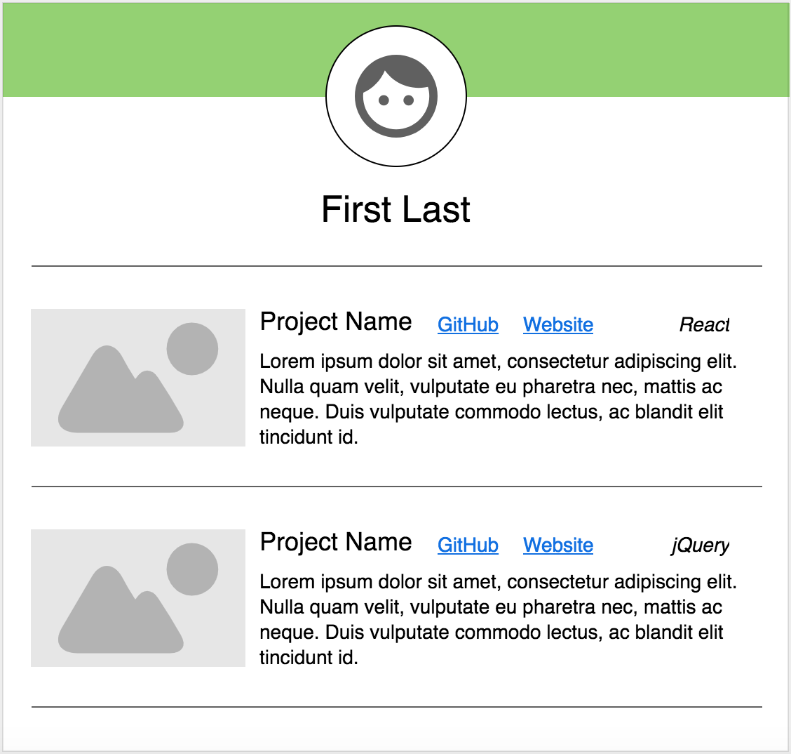
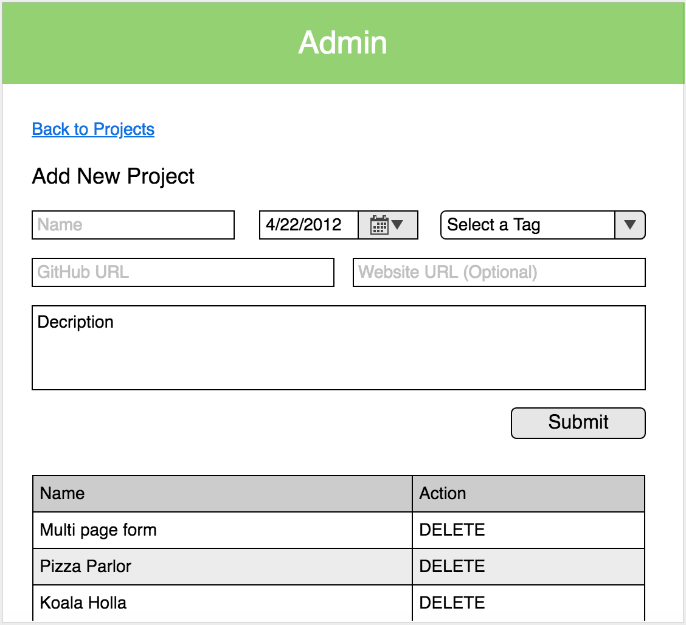
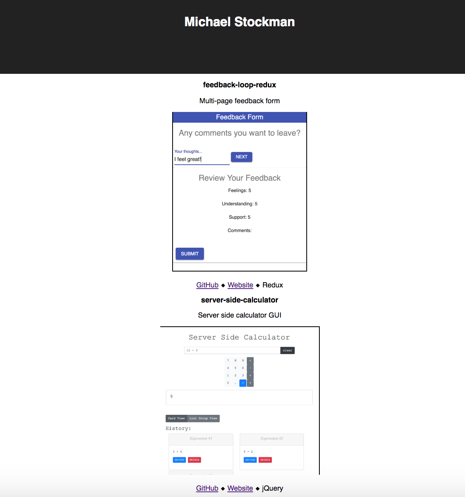
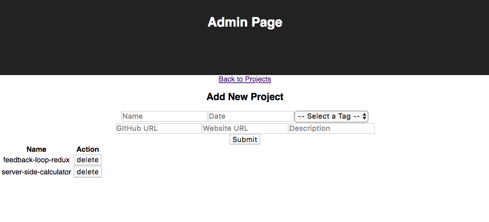

# Personal Project Portfolio
This is a portfolio site to showcase my programming work. The portfolio itself is also a full stack web application that I built to practice React, Redux, and Redux-Saga.

## Built With
- `User Interface` - [React](https://reactjs.org/)
- `Client` - React, [Redux](https://redux.js.org/) for conveniently sharing data between components, [axios](https://www.npmjs.com/package/axios) for making HTTP requests to the server-side, and [redux-saga](https://www.npmjs.com/package/redux-saga) to allow centralizing the functionality for making database requests.
- `Server` - [Node.js](https://nodejs.org/en/) and the [Express](https://expressjs.com/) framework for handling HTTP requests from the client-side
- `Database` - [PostgreSQL](https://www.postgresql.org/) via the Node.js library [pg](https://www.npmjs.com/package/pg)

## Getting Started
The following steps should get a copy of the project running on your local machine. See the deployment section for notes on how to deploy the project on a live system. I recommend using the package manager [`Homebrew`](https://brew.sh/) for installing any needed prerequisites.

### 1. Prerequisite Software
- [Node.js](https://nodejs.org/en/)
- [`PostgreSQL`](https://www.postgresql.org/)

```bash
# To install prerequisites w/ Homebrew...
brew update
brew install node
brew install postgresql
```

### 2. Installation
```bash
# 1. Clone or download this project
git clone https://github.com/mes32/saga-portfolio

# 2. Create a database named 'portfolio'
createdb portfolio

# 3. Create tables named 'tags' and 'projects' inside the portfolio database
#    - See portfolio.sql for detailed SQL instructions

# 4. Install node dependencies using NPM
npm install

# 5. Start the Node.js server (runs on port 5000)
npm run server

# 6. Start the React.js client-side development server (runs on port 3000)
npm run client
```

## Screen Shots

### Project Page (Wireframe)


### Admin Page (Wireframe)


### Project Page (v0.0.0)


### Admin Page (v0.0.0)


## Documentation
Original [scope/instructions](./scope.md) document from [Prime Digital Academy](https://primeacademy.io/) Weekend Assignment #6.

### Completed Features
- [x] Client-side route displays projects that are stored in the database
- [x] Each project conditionally renders a name, description, thumbnail, website, date complete, and a tag.
- [x] Includes links to each project's GitHub page (opens in a new tab)
- [x] Client-side uses Sagas (i.e. redux-saga) to centralize API requests to server-side
- [x] Admin page client-side route
- [x] Admin page includes a form that allows adding new projects to the portfolio
- [x] Admin page lists projects by name (allows deleting projects)

### Next Steps
- [ ] *Prompt admin before deleting projects*
- [ ] Use the GitHub API to get user information and display at the top of the page: photo, name, username, location, github.io, number of repos 
- [ ] *Handle catch statements better in sagas by using yield?*
- [ ] *Move sagas and reducers to their own files*
- [ ] *Improve styling using some basic CSS*
- [ ] Improve styling using Material UI
- [ ] Include a form on the admin page for adding new tags
- [ ] Use the GitHub API to get data related to each project and update
- [ ] *Use Sweet Alert for alert messages*
- [ ] *Allow image upload when adding new projects*
- [ ] Allow adding new project tags on the admin page
- [ ] Allow taggin projects with multiple tags (requires a many-to-many database relationship)
- [ ] *Deploy to Heroku*

## Deployment
(Coming soon...)

## Author
* Michael Stockman

## Acknowledgments
* [James Tucker](https://github.com/jamesctucker) for explaining how to have HTML links open in a new tab when using React
* [Britt Carter](https://github.com/brittbmh) for explaining how to combine multiple currying functions into one export statement
* My instructors at Prime: [Chris](https://github.com/christopher-black), [Ally](https://github.com/Lysautumn), and [Kris](https://github.com/kdszafranski).
